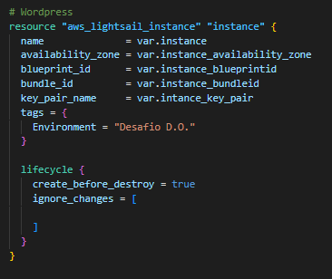
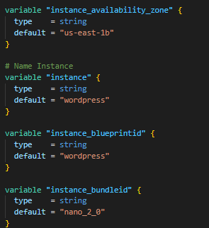
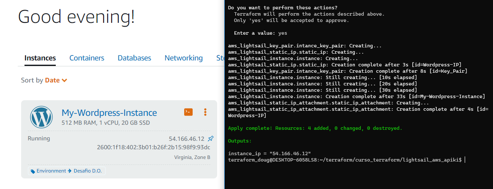
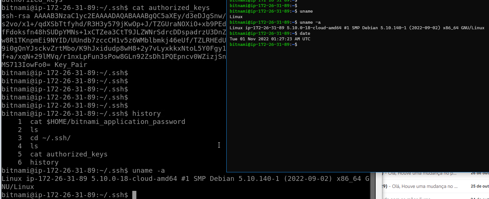
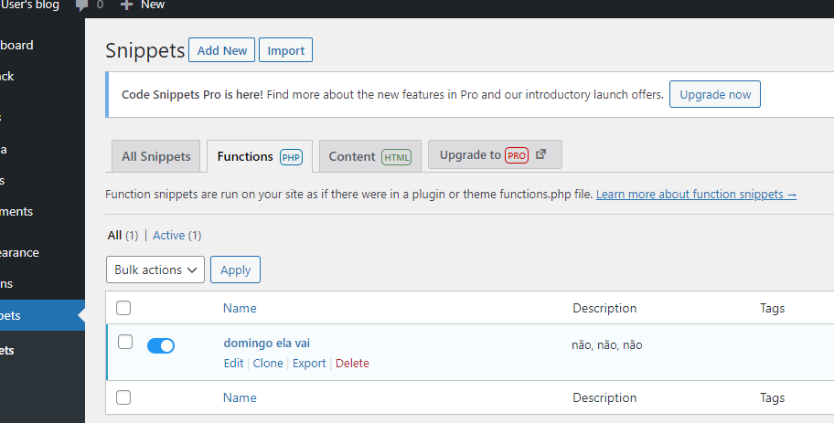

# Devops challenge júnior

Objetivo é demonstrar inteligência, capacidade e organização para realizar tarefas básicas para o cargo.

### Critérios de avaliação:

✔ Organização ` `
✔ Esforço ` `
✔ Entrega em si dos 2 Challenges ` `
✔ Documentação da entrega ` `

### → Challenge Ops:

> Iniciar e configurar uma instância do WordPress no Amazon Lightsail ` `
> https://lightsail.aws.amazon.com/ls/docs/pt_br/articles/amazon-lightsail-tutorial-launching-and-configuring-wordpress ` `
> Fazer da etapa 1 até a 5 somente.

### → Challenge Dev:

> Resolva os 3 erros no plugin` `
> [Plugin DevOps Challenge](devops_challenge.php)

### Entrega

1. Efetue o fork deste repositório e crie um branch com o seu nome e sobrenome. (exemplo: fulano-dasilva)
2. Após finalizar o desafio, crie um Pull Request.
3. Aguarde algum contribuidor realizar o review.
4. Dados de acesso do WordPress e Lightsail com tudo configurado e funcionando
5. Prints e url "http://PublicIpAddress/wp-login.php"
6. Documentação (Opcional)
7. Arquitetura (Opcional)
8. Plugin informado arrumado e versionado
9. Suba o plugin para a sua instalação WordPress Lightsail e ative o mesmo.

a partir daqui, documentei meus desenvolvimento: 

Para fazer a criação da instância eu criei um arquivo terraform Lightsail. todo o código esta no meu github

feita a referência das variáveis em outro arquivo "variables.tf"

todos os comandos foram feitos pelo WSL2 

login, password

wordpress > user > NoJpzXMqmhU6

acesso a instancia usando SSH feito com sucesso, a partir de uma chave privada "ssh-keygen" no usuário bitnami. conforme mostra na imagem.

$ ssh -i ~/.ssh/id_rsa bitnami@54.166.46.12

foi instalado o plugin "*Code Snippet*"

alteração de 3 passos no código

[http://54.166.46.12/wp-login.php](https://lightsail.aws.amazon.com/ls/webapp/us-east-1/static-ips/Wordpress-IP)

